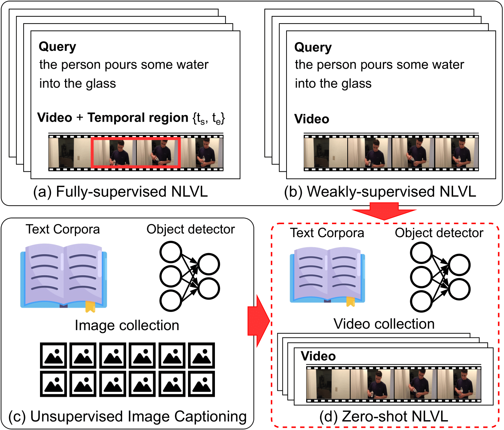

# Zero-shot Natural Language Video Localization (ZSNLVL) by Pseudo-Supervised Video Localization (PSVL)

This repository is for [Zero-shot Natural Language Video Localization](https://openaccess.thecvf.com/content/ICCV2021/papers/Nam_Zero-Shot_Natural_Language_Video_Localization_ICCV_2021_paper.pdf). (ICCV 2021, Oral)


We first propose a novel task of zero-shot natural language video localization. The proposed task setup does not require any paired annotation cost for NLVL task but only requires easily available text corpora, off-the-shelf object detector, and a collection of videos to localize. To address the task, we propose a **P**seudo-**S**upervised **V**ideo **L**ocalization method, called **PSVL**, that can generate pseudo-supervision for training an NLVL model. Benchmarked on two widely used NLVL datasets, the proposed method exhibits competitive performance and performs on par or outperforms the models trained with stronger supervision.




---
## Environment
This repository is implemented base on [PyTorch](http://pytorch.org/) with Anaconda.</br>
Refer to below instruction or use **Docker** (dcahn/psvl:latest). </br>


### Get the code
- Clone this repo with git, please use:
```bash
git clone https://github.com/gistvision/PSVL.git
```

- Make your own environment (If you use docker envronment, you just clone the code and execute it.)
```bashz
conda create --name PSVL --file requirements.txt
conda activate PSVL
```

#### Working environment
- RTX2080Ti (11G)
- Ubuntu 18.04.5
- pytorch 1.5.1

## Download

### Dataset & Pretrained model

- This [link](https://drive.google.com/file/d/1Vjgm2XA3TYcc4h9IWR5k5efU-bXNir5f/view?usp=sharing) is connected for downloading video features used in this paper. </br>
: After downloading the video feature, you need to set the `data path` in a config file. </br> 

- This [link](https://drive.google.com/file/d/1M2FX2qkEvyked50LSc9Y5r87GBnpohSX/view?usp=sharing) is connected for downloading pre-trained model.

## Evaluating pre-trained models

If you want to evaluate the pre-trained model, you can use below command.

```bash
python inference.py --model CrossModalityTwostageAttention --config "YOUR CONFIG PATH" --pre_trained "YOUR MODEL PATH"
```

## Training models from scratch

To train PSVL, run `train.py` with below command.

```bash
# Training from scratch
python train.py --model CrossModalityTwostageAttention --config "YOUR CONFIG PATH"
# Evaluation
python inference.py --model CrossModalityTwostageAttention --config "YOUR CONFIG PATH" --pre_trained "YOUR MODEL PATH"
```

## Lisence
MIT Lisence

## Citation

If you use this code, please cite:
```
@inproceedings{nam2021zero,
  title={Zero-shot Natural Language Video Localization},
  author={Nam, Jinwoo and Ahn, Daechul and Kang, Dongyeop and Ha, Seong Jong and Choi, Jonghyun},
  booktitle={Proceedings of the IEEE/CVF International Conference on Computer Vision},
  pages={1470-1479},
  year={2021}
}
```

## Contact
If you have any questions, please send e-mail to me (skaws2012@gmail.com, daechulahn@gm.gist.ac.kr)